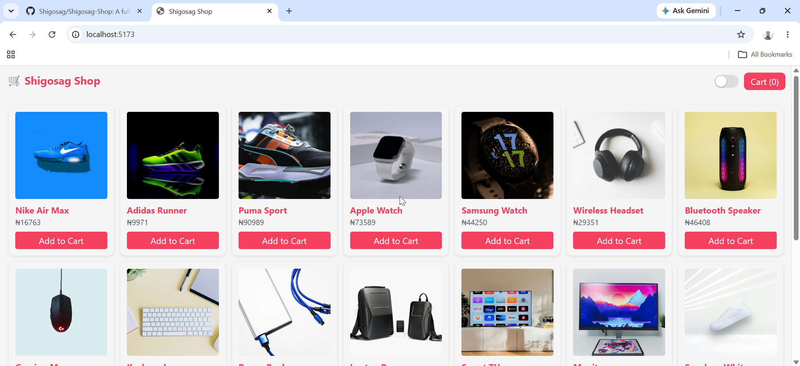
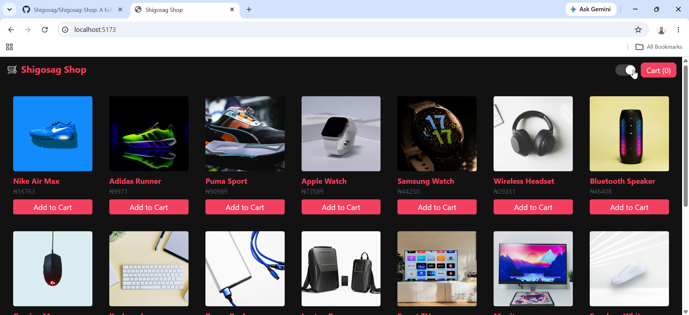
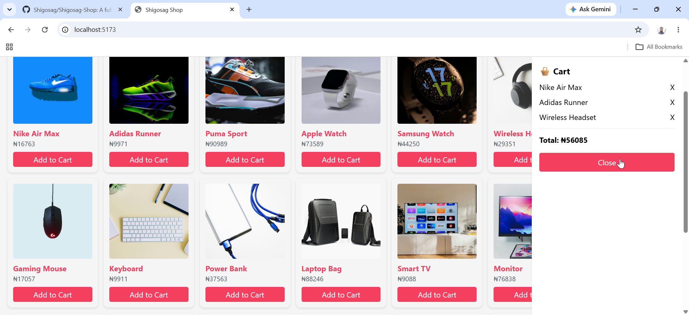

# 🛒 Shigosag Shop

[](https://www.typescriptlang.org/)
[](https://nodejs.org/)  
[](https://neon.tech/)
[](LICENSE)

A full-stack eCommerce platform built with React, Node.js, Express, Prisma ORM, and PostgreSQL (Neon). It includes product management, shopping cart functionality, responsive product grid, and a scalable REST API backend.

---

## 🌐 Live Demo

🚀 **Visit Shigosag Shop:**  
https://shigosag-shop.vercel.app

---

### 🎥 System Walkthrough & Demo

<div align="center">
  <video src="https://github.com/user-attachments/assets/de09ef89-dd5d-4f8a-8fc6-b4c2b2d1bf6e" width="100%" controls></video>
</div>

**Timestamps:**
- **0:00** - Dashboard Light Mode Overview
- **0:13** - Dashboard Dark Mode Overview
- **0:26** - Add to Cart
- **0:40** - Cart Overview
- **1:03** - GitHub Repository Overview
  
---

## 🚀 Features

- 🛍 Product listing system
- 🛒 Add to cart functionality
- ⚡ Fast React + Vite frontend
- 🔗 REST API backend (Express)
- 🗄 PostgreSQL database (Neon)
- 🧠 Prisma ORM for database handling
- 🎯 Responsive grid layout
- 💾 Persistent product storage via seed script
- 🌙 Dark mode support
- 🎨 Portfolio/demo friendly

---

## 🧱 Tech Stack

### Frontend
- ⚛️ React
- 📝 TypeScript
- ⚡ Vite
- 🎨 Tailwind CSS CDN

### Backend
- 🟢 Node.js
- 🚀 Express
- ⚡ Prisma ORM
- 🗄️ PostgreSQL (Neon)

---

## 🗂️ Project Structure

```text
Shigosag-Shop/
│
├── backend/
│   ├── prisma/
│   ├── src/
│   └── server.ts
│
├── frontend/
│   ├── src/
│   ├── public/
│   └── index.html
└── README.md
```

----

## 🖼️ Dashboard Preview

| Light Mode | Dark Mode |
| :---: | :---: |
|  |  |

### Cart


---

## ⚙️ Setup Instructions

## Prerequisites
- Node.js (v18+)

### Clone Repository

```bash
git clone https://github.com/Shigosag/Shigosag-Shop.git
cd Shigosag-Shop
```

---

## 🖥 Backend Setup

```bash
cd backend
npm install

npx prisma generate
npx prisma db push

npx tsx prisma/seed.ts

npm run dev
```

Backend runs on: http://localhost:5000

## 🌐 Frontend Setup

```bash
cd frontend
npm install
npm run dev
```

Frontend runs on: http://localhost:5173

---

## 📦 API Endpoints

### Get all products

```http
GET /api/products
```

---

## 🌱 Database Seeding

The project includes a seed script that automatically populates sample products:

- Nike Air Max
- Adidas Runner
- Apple Watch
- Gaming Mouse
- And more...

---

## 🖼 Product Images

Images are stored locally inside:

```txt
frontend/public/images/
```

---

## 🧠 Future Improvements

- Admin dashboard (upload products + images)
- Authentication system
- Payment integration
- Cloud image storage (Cloudinary)
- Product search & filters
- Order system

---

## 👤 Author & Credits

- **Shigosag**
- Built for learning and portfolio purposes.
- Portions of code generated with AI support

---

## 📜 License

MIT License

This project is open-source and free to use.

© 2026 Shigosag

---

**🚀 Powered by Shigosag**
